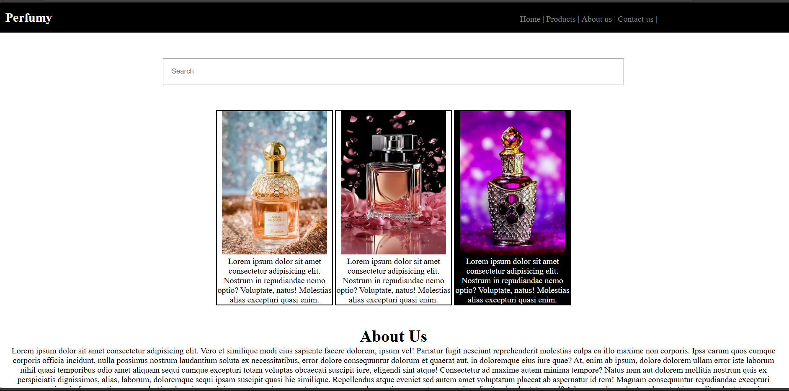

# PERFUMY - CSS Project

**Perfumy** is a simple, visually appealing website layout designed for a fictional perfume brand. The project demonstrates how to structure a website using **HTML** and highlights **CSS** for styling, layout, responsiveness, and interactivity. It is ideal for beginners learning front-end development and UI design principles.

---

## Project Overview

The website consists of several key sections:

1. **Header & Navigation**

   * A top navigation bar with the brand name and menu links (Home, Products, About Us, Contact Us).
   * Menu items highlight on hover to improve user interactivity.
   * Responsive inline display of navigation items using CSS `display:inline-block`.
   * HTML concepts used: `<nav>`, `<ul>`, `<li>`, `<h1>`.
   * **CSS concepts used**: background-color, color, padding, margin, hover effects, display properties.

2. **Search Bar**

   * A centered search input field.
   * HTML concepts used: `<input>` with placeholder.
   * **CSS concepts used**: width, padding, text-align, centering using `text-align:center`.

3. **Products Section**

   * Displays multiple products using `.box` containers.
   * Each box includes a product image and description.
   * Hover effect changes the background color and text color.
   * HTML concepts used: `<div>`, ``, `<p>`.
   * **CSS concepts used**: border properties, display, width, margin, padding, hover effects, text styling.

4. **About Us Section**

   * Contains heading and descriptive paragraph.
   * HTML concepts used: `<div>`, `<h1>`, `<p>`.
   * **CSS concepts used**: text-align, margin, padding.

5. **Contact Section**

   * Displays contact information.
   * HTML concepts used: `<div>`, `<h4>`, `<p>`.
   * **CSS concepts used**: background-color, color, text-align, padding, inline styling.

---

## Features

* Fully structured layout with header, search bar, products, about, and contact sections.
* Hover effects on product boxes and navigation items.
* Centered layout for products and content.
* Clean design suitable for small businesses.
* Highlights **CSS** concepts:

  * Inline styling (for specific `<p>` elements)
  * Classes and IDs (`.box`, `.searchbar`, `.products`, `.about`, `.contact`)
  * Pseudo-classes (`:hover`)
  * Box model (padding, margin, border)
  * Text styling (color, font-size, text-align)
  * Display properties (`inline-block`, `block`)

---

## Technologies Used

* **HTML5**: Structure and content.
* **CSS3**: Styling, layout, hover effects, and interactivity.
* Optional: JavaScript can be added for dynamic features.

---

## Project Structure

```
perfumy/
│
├── index.html          # Main HTML file
├── style.css           # Styling for the website (CSS highlighted)
├── perfumee_img_1.jpg  # Product image 1
├── perfume_img_2.jpg   # Product image 2
├── perfumee_img_3.jpg  # Product image 3
└── README.md           # Project documentation
```

---

## Installation / Usage

1. Clone the repository:

   ```bash
   git clone https://github.com/monikha-19/perfumy.git
   ```
2. Navigate to the project folder:

   ```bash
   cd perfumy
   ```
3. Open `index.html` in a modern web browser to view the website.

---

## Screenshot

**

---


This project is open-source and available under the MIT License.

